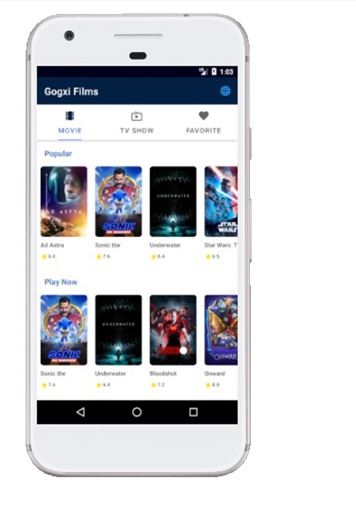
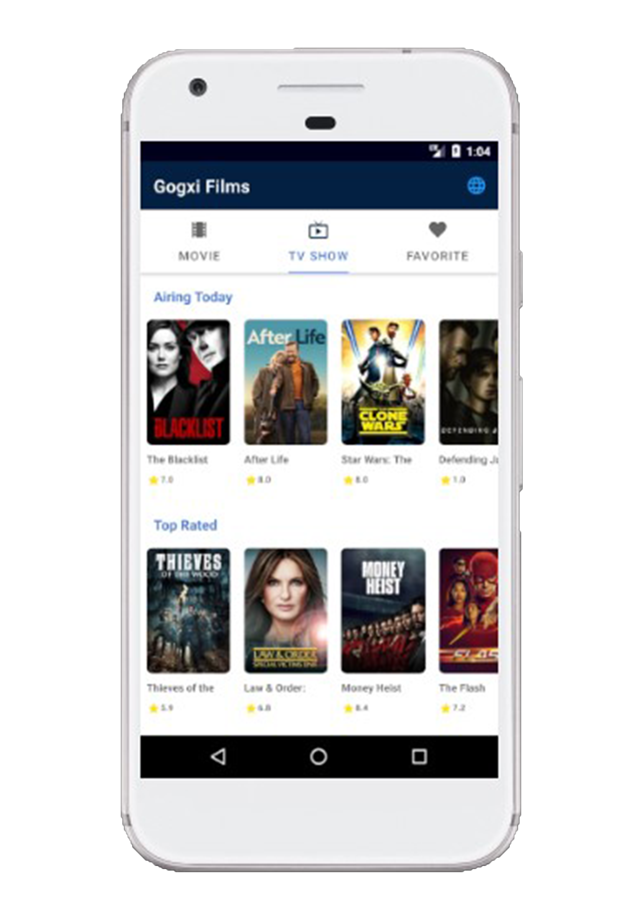
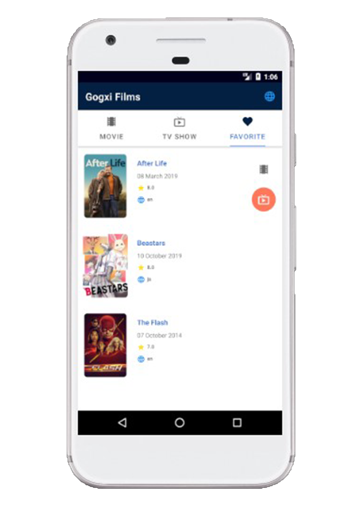
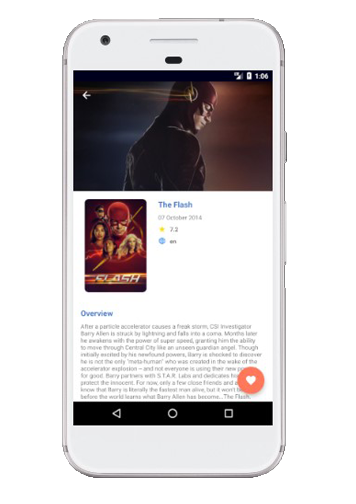

## Deskripsi
Project Gogxi-Films adalah submission project untuk kelas [__Dicoding - Belajar Fundamental Aplikasi Android__](https://www.dicoding.com/academies/14). 
Repository ini berisi source code submission 3. 
- [x] Live Data
- [x] View Model
- [x] Retrofit
- [x] Localization
- [x] MVVM
- [x] CollapsingToolbarLayout

## Tampilan Aplikasi

